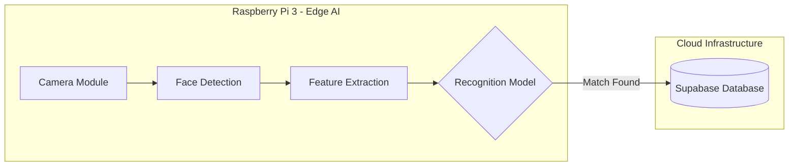
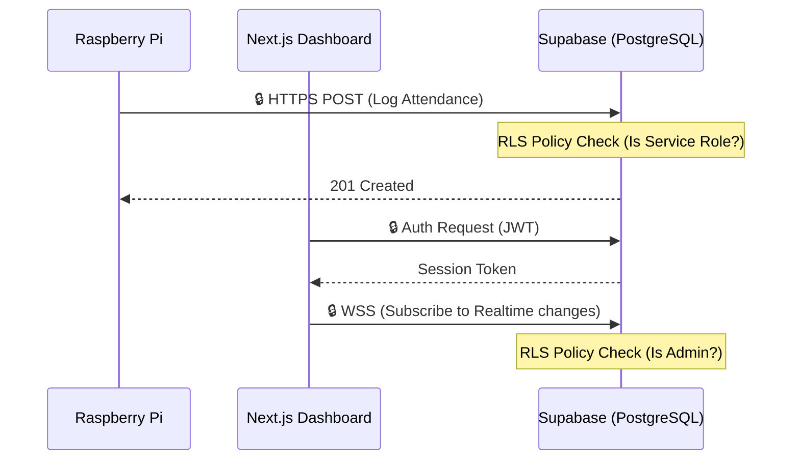
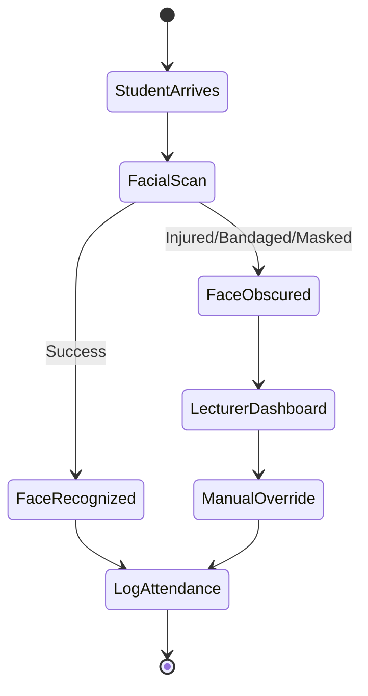
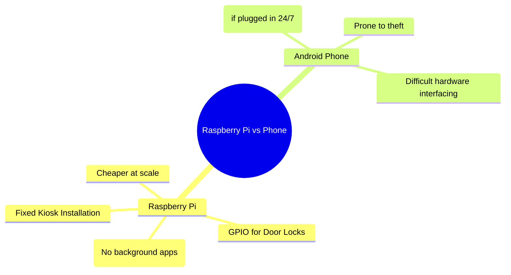
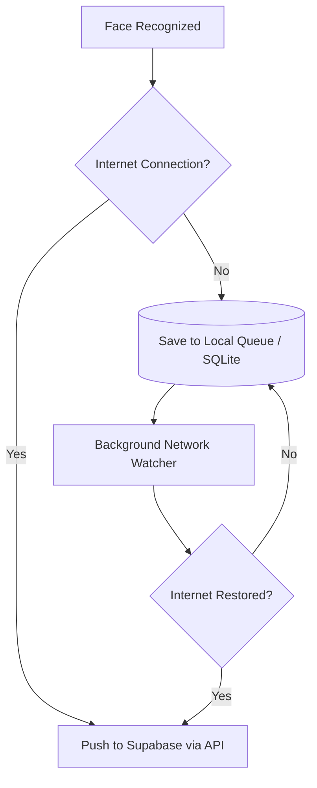
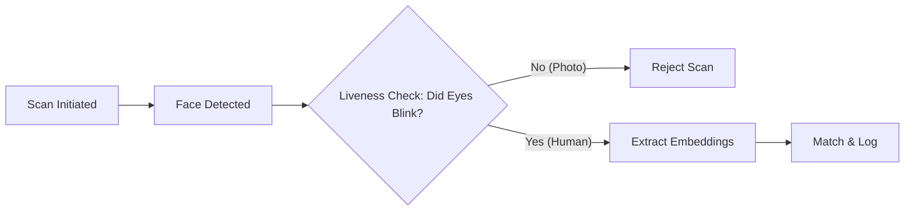
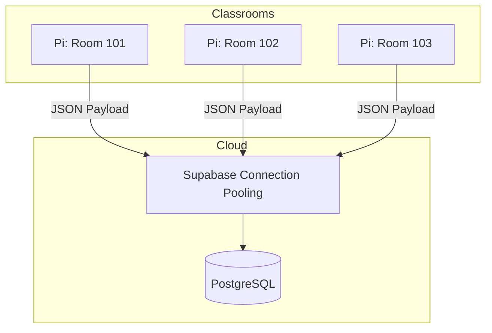

# Greetly: FYP Pitch & Q&A Defense Guide

This document prepares you for your Final Year Project (FYP) presentation. It contains highly probable and challenging questions from the panel, along with professional answers, system architecture diagrams to illustrate your points, and presentation tips to ace your defense.

---

## 1. "You say your system has AI, where is the AI? Show me."

**Answer:**
"The Artificial Intelligence in Greetly is deployed on the 'Edge'—specifically on the Raspberry Pi 3. Rather than sending heavy video feeds to the cloud (which is slow and expensive), the AI model runs locally. We use OpenCV combined with a facial recognition model (e.g., Haar Cascades or Deep Learning-based embeddings) to detect a face, extract its unique features, and match it against our localized dataset. Once the AI verifies the identity, only a lightweight JSON payload is sent to our Supabase backend to record the attendance."

**Visual Context:**

> [!TIP]
> **Actionable Tip:** Point directly to the Raspberry Pi during this answer. Mention "Edge AI" or "Edge Computing"—panels love industry-standard buzzwords. If possible, show a terminal window outputting the recognition confidence score.

---

## 2. "Where are the security features of this system? Can the data be hacked or leaked?"

**Answer:**
"Security is integrated at multiple layers of Greetly. 
1. **Transit:** All communication between the Raspberry Pi, the Next.js Dashboard, and Supabase happens over encrypted HTTPS and WSS (WebSockets) protocols.
2. **Database Level:** We utilize Supabase's Row Level Security (RLS). This means even if an API key is exposed, attackers cannot read or alter the attendance data unless they are authenticated and authorized as an Admin/Lecturer.
3. **Authentication:** Dashboard access is secured via Supabase Auth using secure JWTs (JSON Web Tokens). Passwords are never stored in plain text."

**Visual Context:**

> [!TIP]
> **Actionable Tip:** Have the Supabase Dashboard open in a browser tab. If they press hard on security, physically show them the RLS policies (e.g., `CREATE POLICY "Enable read access for admins only"`).

---

## 3. "What happens if a student gets into an accident and their face is injured/bandaged? How do they take attendance?"

**Answer:**
"Facial recognition is our primary, frictionless method, but it is not the only method. Technology should assist, not block. For edge cases where a student's face is heavily bandaged, obscured, or if there is a hardware failure, Greetly features a manual fallback mechanism. The Lecturer or Admin can log into the Next.js Dashboard and manually mark the student's attendance for that specific session."

**Visual Context:**

> [!IMPORTANT]
> **Actionable Tip:** Emphasize that enterprise systems always have fallback protocols. This shows you are thinking practically as a software engineer, not just relying 100% on a "perfect" AI scenario.

---

## 4. "Why use a Raspberry Pi? Why not just use a smartphone or an Android app?"

**Answer:**
"We chose a Raspberry Pi because this system is designed as a dedicated, fixed IoT (Internet of Things) kiosk. 
1. **Dedicated Hardware:** A smartphone can be easily stolen, moved, or interrupted by personal notifications. A Raspberry Pi can be securely mounted at a classroom entrance.
2. **Extensibility:** The Pi has GPIO (General Purpose Input/Output) pins. In the future, Greetly could be connected to an electronic door lock (to only open for recognized students) or LED indicators, which is much harder to achieve reliably with a standard Android phone."

**Visual Context:**

> [!TIP]
> **Actionable Tip:** Mentioning the GPIO pins for future electronic door locks is a great way to show system extensibility. Evaluators love seeing a roadmap for future development.

---

## 5. "What if the internet goes down? Does the whole system crash?"

**Answer:**
"No, the system is designed with offline tolerance. If the classroom loses WiFi, the Raspberry Pi will continue to recognize faces and will store the attendance logs locally in a temporary SQLite database or CSV queue. We have a background script that pings the network; once the internet connection to Supabase is restored, the Pi automatically flushes the queued records to the cloud database. No data is lost."

**Visual Context:**

> [!WARNING]
> **Actionable Tip:** If you haven't coded this offline-queue feature yet, phrase it as: *"The architecture allows for offline tolerance, which is our immediate next phase of development..."* Be honest about what is fully implemented versus what is designed.

---

## 6. "How do you handle spoofing? What if a student holds up a photo of their friend to the camera?"

**Answer:**
"Spoofing is a known challenge in facial recognition. We combat this by implementing basic 'Liveness Detection' on the edge. Using OpenCV, we can require the user to perform a micro-expression, such as blinking. The system looks for the Eye Aspect Ratio (EAR) to change before validating the scan. A static printed photo will not blink, causing the scan to fail."

**Visual Context:**

> [!TIP]
> **Actionable Tip:** Bring a printed photo of yourself to the presentation. Offer to let the panel test it on the camera. Showing a failed spoof attempt live is an incredible "wow" factor.

---

## 7. "How scalable is this? What if 1,000 students try to scan at 8:00 AM across the university?"

**Answer:**
"Because we use Edge AI, the heavy lifting (video processing) is distributed across the Raspberry Pis in every classroom. The central server is not processing 1,000 video streams. It is only receiving lightweight HTTP POST requests containing an ID and a timestamp. Our backend is Supabase, which runs on a highly scalable PostgreSQL database capable of handling tens of thousands of concurrent writes using connection pooling (PgBouncer). Therefore, the system is highly scalable."

**Visual Context:**

> [!TIP]
> **Actionable Tip:** Use the term "Distributed Computing" or "Offloading Computation to the Edge." It shows a deep understanding of system architecture and cloud resource management.
