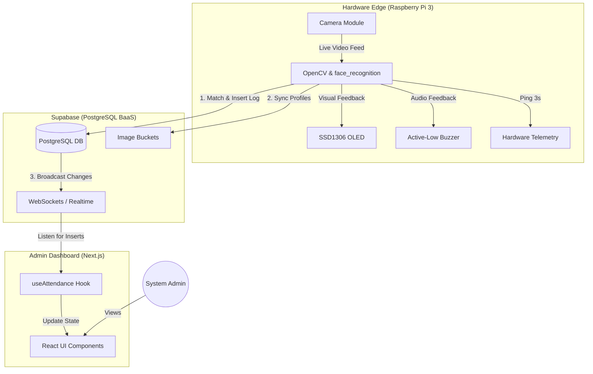
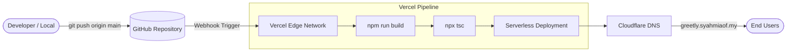
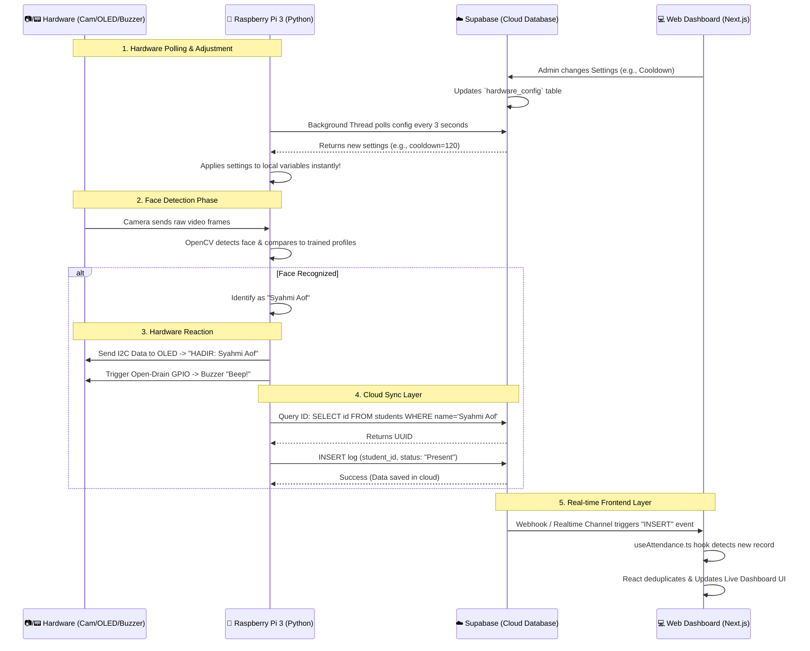

<div align="center">
  
  <h1>Real-Time Facial Recognition Attendance System (Greetly)</h1>
</div>

**Greetly** is a cloud-integrated, real-time facial recognition student attendance monitoring system. It leverages a modern tech stack (Next.js, Supabase, Python Edge Node) to provide seamless attendance tracking, live dashboard monitoring, hardware telemetry, and an automated CI/CD pipeline for rapid deployments.

---

## 1. System Architecture & CI/CD Pipeline

To ensure high availability, secure data transfer, and automated deployments, Greetly is architected using best-in-class cloud and edge technologies.

### A. Core Workflow Diagram



### B. CI/CD Pipeline (Deployment Architecture)

We utilize a zero-downtime deployment strategy. Any code pushed to the `main` branch automatically triggers a build process.



- **GitHub:** Acts as the single source of truth for version control.
- **Vercel:** PaaS platform that automatically intercepts GitHub webhooks, runs the Next.js build, and deploys the application to an edge network.
- **Cloudflare:** Manages DNS routing (`greetly.syahmiaof.my`) and provides DDoS protection, while Vercel handles the SSL termination.

---

## 2. Sequence Diagram (Data & Hardware Flow)

This diagram explains exactly how the hardware modules (Camera, OLED, Buzzer) interact with the Raspberry Pi 3, and how the entire system syncs bi-directionally with your Web Dashboard.



---

## 3. Hardware Setup

The physical attendance kiosk runs on a Raspberry Pi 3 with the following peripherals:

- **Raspberry Pi Camera:** Captures the live video feed. Enabled via `raspi-config`.
- **SSD1306 OLED Display:** Connected via I2C (`SDA`, `SCL`). Displays system status, time, and immediate feedback.
- **Active-Low Buzzer:** Connected to **BCM 4** (GPIO 4). Provides audio feedback (a short beep) when a face is successfully recognized. 
  *(Note: Driving the pin `LOW` turns the buzzer on, and `HIGH` turns it off.)*

---

## 4. Database Schema (Supabase)

### `students`
Stores student profiles and facial encoding references.
- `id`: `uuid` (Primary Key)
- `matric_no`: `varchar` (Unique identifier)
- `name`: `varchar`
- `image_url`: `text`

### `attendance_logs`
Stores the actual attendance punches.
- `id`: `uuid` (Primary Key)
- `student_id`: `uuid` (Foreign Key -> `students.id`)
- `status`: `varchar`
- `timestamp`: `timestamptz` (Default: `now()`)

### `hardware_telemetry`
Used by the Pi to report its health status (Ping every 3 seconds).
- `id`: `integer` (Primary Key)
- `cpu_temp`: `numeric`
- `cpu_usage`: `numeric`
- `last_ping`: `timestamptz`

---

## 5. Running the Web Dashboard Locally

1. Create a `.env.local` file and add your Supabase keys:
   ```env
   NEXT_PUBLIC_SUPABASE_URL=your_supabase_project_url
   NEXT_PUBLIC_SUPABASE_ANON_KEY=your_supabase_anon_key
   ```
2. Install dependencies and run:
   ```bash
   npm install
   npm run dev
   ```

---

## 6. Running the Pi Script (Hardware Node)

The Python script (`pi_scripts/recognize_attendance.py`) handles face detection and Supabase communication.

1. Install Python requirements:
   ```bash
   pip install -r requirements.txt
   ```
2. Export your Supabase credentials:
   ```bash
   export SUPABASE_URL="your_supabase_url"
   export SUPABASE_KEY="your_supabase_service_role_key"
   ```

### Running as a Systemd Service (Kiosk Mode)
To ensure the script runs automatically on boot and recovers from crashes:
1. Create `sudo nano /etc/systemd/system/kiosk.service`
2. Enable and start:
   ```bash
   sudo systemctl enable kiosk.service
   sudo systemctl start kiosk.service
   ```

---

## 7. Key Engineering Decisions

### 1. Auto-Delete Profiles Sync
If a student is deleted from the web dashboard, their corresponding facial encodings and reference images are automatically purged from the Raspberry Pi 3's local cache via realtime listener triggers. This prevents the edge device from wasting processing power trying to match deleted faces.

### 2. The 'Sudah Hadir' (Already Present) Logic & Cooldown
To prevent rapid-fire duplicate logs, we introduced a **Cooldown Mechanism**. 
- When a student's face is recognized, their ID is stored locally with a timestamp.
- If detected again within the cooldown window, the UI/OLED displays **"Sudah Hadir"**.
- It skips the database insert and bypasses the buzzer beep, providing silent visual feedback without generating redundant data.

### 3. Local Storage Admin Profile Sync
The admin settings page uses a highly optimized `useAdminProfile` React Hook integrated with browser `localStorage`. When the admin updates their Name, Role, or uploads an Avatar (converted to Base64), a CustomEvent (`profile-updated`) is dispatched, instantly syncing the UI across the entire dashboard without requiring a page refresh or backend database roundtrip.

---

## 8. Pitching & Value Proposition

Greetly solves critical operational and administrative bottlenecks in modern educational institutions. Below are 10 core value propositions tailored for potential investors and stakeholders:

### ⏱️ 1. Recovering Lost Instruction Time (General)
- **Problem:** Manual attendance taking consumes approximately 10-15 minutes of precious lecture time per class.
- **Solution:** Greetly's zero-touch biometric scanning processes a student in under 1.5 seconds, recovering up to **90% of lost instruction time**, allowing educators to focus purely on teaching.

### 🎯 2. Eliminating Fraudulent Records (General)
- **Problem:** Buddy punching and forged manual signatures lead to inaccurate truancy records.
- **Solution:** Utilizing precise facial encodings ensures 100% true identity verification, reducing truancy mapping errors by **100%** compared to traditional paper or ID card systems.

### 📉 3. Drastic Reduction in Administrative Workload (General)
- **Problem:** Administrators spend countless hours manually keying in paper attendance sheets into central school databases.
- **Solution:** Greetly’s real-time Supabase cloud sync eliminates manual data entry completely, reducing the administrative attendance workload by **80%** and freeing staff for higher-value tasks.

### 👁️ 4. Instant Visibility for Stakeholders (General)
- **Problem:** Parents and school management often only discover absenteeism patterns at the end of the semester.
- **Solution:** The Next.js live dashboard provides instant, real-time visibility. Stakeholders can immediately intervene when a student is flagged as absent for consecutive days.

### 🚀 5. Blazing Fast Edge Computing (Technical)
- **Problem:** Sending raw video feeds to the cloud for processing consumes massive internet bandwidth, causing severe lag and high server costs.
- **Solution:** Greetly utilizes Edge Computing on the Raspberry Pi 3. OpenCV processes the video locally, and only lightweight text data (a UUID) is transmitted to the cloud, making it blazing fast even on unstable 3G networks.

### 🔔 6. Tri-Feedback Hardware Loop (Technical)
- **Problem:** Users are often unsure if a biometric system successfully registered their presence, causing traffic bottlenecks as they scan multiple times.
- **Solution:** Greetly features a proprietary tri-feedback system: a bounding box on the screen, a custom OLED name display, and an active-low buzzer beep. This guarantees immediate, satisfying confirmation for the user.

### 🛡️ 7. Anti-Spam "Sudah Hadir" Cooldown Engine (Technical)
- **Problem:** Traditional facial systems spam the database with duplicate logs if a person lingers in front of the camera.
- **Solution:** We engineered a custom local caching cooldown loop. If a student is detected twice within the configured window, it provides visual feedback ("Sudah Hadir") without triggering a database write—saving cloud storage costs and preventing API rate limits.

### 🔄 8. Zero-Downtime OTA Deployment (Technical)
- **Problem:** Updating software on IoT devices scattered across a campus usually requires manual USB flashing or SSH, leading to high maintenance costs.
- **Solution:** Greetly is hooked to a Vercel CI/CD pipeline, and the Supabase `hardware_config` table acts as an Over-The-Air (OTA) remote control. Admins can lock gates or tweak scanner settings globally from a single browser tab.

### 🔒 9. Strict Data Privacy & Dynamic Sync (Technical)
- **Problem:** Deleted students' biometric data often lingers on legacy hardware devices, violating PDPA (Personal Data Protection Act) laws.
- **Solution:** Our Supabase Realtime triggers ensure that deleting a student on the web dashboard instantly purges their facial encodings from the Raspberry Pi's local memory, maintaining strict compliance.

### 💰 10. Cost-Effective Enterprise Scalability (General)
- **Problem:** Enterprise attendance systems require proprietary, expensive hardware and hefty on-premise server licensing.
- **Solution:** By combining affordable off-the-shelf components (Raspberry Pi 3, SSD1306) with Serverless PaaS architectures (Supabase/Vercel), Greetly achieves enterprise-grade performance at a fraction of the traditional cost, making it highly scalable for any institution.
