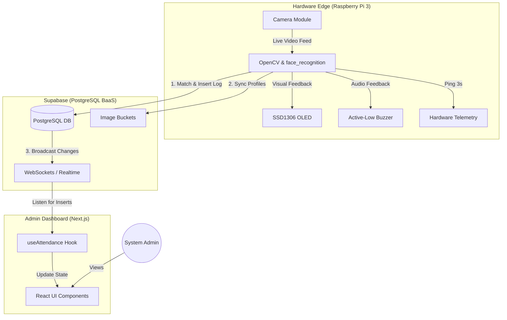
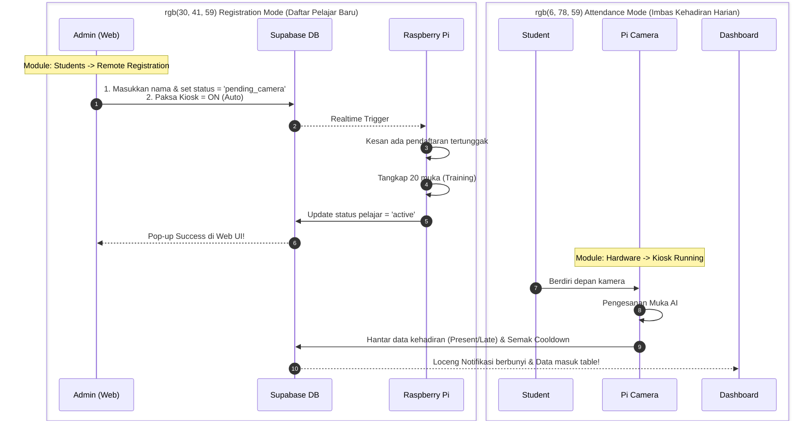

<div align="center">
  
  <h1>Real-Time Facial Recognition Attendance System (Greetly)</h1>
</div>

Developed by syahmiaof. **Greetly** is a cloud-integrated, real-time facial recognition student attendance monitoring system. It leverages a modern tech stack (Next.js 15, Tailwind CSS v4, Supabase Auth/Realtime, Python Edge Node) to provide seamless attendance tracking, live dashboard monitoring, hardware telemetry, and an automated CI/CD pipeline for rapid deployments.

---

## 1. System Architecture & CI/CD Pipeline

To ensure high availability, secure data transfer, and automated deployments, Greetly is architected using best-in-class cloud and edge technologies.

### A. Core Workflow Diagram



### B. CI/CD Pipeline (Deployment Architecture)

We utilize a zero-downtime deployment strategy. Any code pushed to the `main` branch automatically triggers a build process.


- **GitHub:** Acts as the single source of truth for version control.
- **Vercel:** PaaS platform that automatically intercepts GitHub webhooks, runs the Next.js build, and deploys the application to an edge network.
- **Cloudflare:** Manages DNS routing (`greetly.syahmiaof.my`) and provides DDoS protection, while Vercel handles the SSL termination.

---

## 2. Sequence Diagram (Data & Hardware Flow)

This diagram explains exactly how the hardware modules (Camera, OLED, Buzzer) interact with the Raspberry Pi 3, and how the entire system syncs bi-directionally with your Web Dashboard.

```mermaid
sequenceDiagram
    participant Hardware as =ƒô+/=ƒôƒ Hardware (Cam/OLED/Buzzer)
    participant Python as =ƒìô Raspberry Pi 3 (Python)
    participant Supabase as Gÿün+Å Supabase (Cloud Database)
    participant NextJS as =Į+ Web Dashboard (Next.js)

    Note over Hardware, Python: 1. Hardware Polling & Adjustment
    NextJS->>Supabase: Admin changes Settings (e.g., Cooldown)
    Supabase->>Supabase: Updates `hardware_config` table
    Python->>Supabase: Background Thread polls config every 3 seconds
    Supabase-->>Python: Returns new settings (e.g., cooldown=120)
    Python->>Python: Applies settings to local variables instantly!

    Note over Hardware, Python: 2. Face Detection Phase
    Hardware->>Python: Camera sends raw video frames
    Python->>Python: OpenCV detects face & compares to trained profiles
    
    alt Face Recognized
        Python->>Python: Identify as "Syahmi Aof"
        
        Note over Hardware, Python: 3. Hardware Reaction
        Python->>Hardware: Send I2C Data to OLED -> "HADIR: Syahmi Aof"
        Python->>Hardware: Trigger Open-Drain GPIO -> Buzzer "Beep!"
        
        Note over Python, Supabase: 4. Cloud Sync Layer
        Python->>Supabase: Query ID: SELECT id FROM students WHERE name='Syahmi Aof'
        Supabase-->>Python: Returns UUID
        Python->>Supabase: INSERT log (student_id, status: "Present")
        Supabase-->>Python: Success (Data saved in cloud)
    end

    Note over Supabase, NextJS: 5. Real-time Frontend Layer
    Supabase->>NextJS: Webhook / Realtime Channel triggers "INSERT" event
    NextJS->>NextJS: useAttendance.ts hook detects new record
    NextJS->>NextJS: React deduplicates & Updates Live Dashboard UI
```



---


### 3. Registration vs. Attendance Workflow (Perbandingan)



## 4. Hardware Setup

The physical attendance kiosk runs on a Raspberry Pi 3 with the following peripherals:

- **Raspberry Pi Camera:** Captures the live video feed. Enabled via `raspi-config`.
- **SSD1306 OLED Display:** Connected via I2C (`SDA`, `SCL`). Displays system status, time, and immediate feedback.
- **Active-Low Buzzer:** Connected to **BCM 4** (GPIO 4). Provides audio feedback (a short beep) when a face is successfully recognized. 
  > [!CAUTION]
  > **CRITICAL HARDWARE WARNING**
  > 1. The Active-Low Buzzer is connected directly between the Pi's 5V pin and BCM 4 (GPIO 4).
  > 2. Because of this 5V to 3.3V mismatch, you CANNOT use standard GPIO.OUT with GPIO.HIGH to turn the buzzer off. Doing so causes a 1.7V drop across the buzzer, making it scream continuously.
  > 3. The ONLY way to silence the buzzer is to use the "High-Z Open-Drain Hack": you MUST set the pin to `GPIO.IN` (with `pull_up_down=GPIO.PUD_OFF`) to float the pin and stop all current from flowing to Ground. 
  > 4. To sound the buzzer, you set the pin to `GPIO.OUT` with `initial=GPIO.LOW` to complete the circuit to Ground.
  > 5. NEVER remove this hack from `pi_scripts/recognize_attendance.py`, or the user will go deaf.

---

## 5. Database Schema (Supabase)

### `students`
Stores student profiles and facial encoding references.
- `id`: `uuid` (Primary Key)
- `matric_no`: `varchar` (Unique identifier)
- `name`: `varchar`
- `image_url`: `text`

### `attendance_logs`
Stores the actual attendance punches.
- `id`: `uuid` (Primary Key)
- `student_id`: `uuid` (Foreign Key -> `students.id`)
- `status`: `varchar`
- `timestamp`: `timestamptz` (Default: `now()`)

### `hardware_telemetry`
Used by the Pi to report its health status (Ping every 3 seconds).
- `id`: `integer` (Primary Key)
- `cpu_temp`: `numeric`
- `cpu_usage`: `numeric`
- `last_ping`: `timestamptz`

---

## 5B. Next-Gen Dashboard Features

- **Dynamic Theme Switcher:** Choose between Deep Tech, Emerald Zamrud, and Amethyst Galaxy.
- **Secure Auth Middleware:** Route protection via Supabase Server-Side Rendering (SSR).
- **Live Hardware Telemetry:** Ping tracking and remote cooling/shutdown commands for edge devices.

## 6. Running the Web Dashboard Locally

1. Create a `.env.local` file and add your Supabase keys:
   ```env
   NEXT_PUBLIC_SUPABASE_URL=your_supabase_project_url
   NEXT_PUBLIC_SUPABASE_ANON_KEY=your_supabase_anon_key
   ```
2. Install dependencies and run:
   ```bash
   npm install
   npm run dev
   ```

---

## 7. Running the Pi Script (Hardware Node)

The Python script (`pi_scripts/recognize_attendance.py`) handles face detection and Supabase communication.

1. Install Python requirements:
   ```bash
   pip install -r requirements.txt
   ```
2. Export your Supabase credentials:
   ```bash
   export SUPABASE_URL="your_supabase_url"
   export SUPABASE_KEY="your_supabase_service_role_key"
   ```

### Running as a Systemd Service (Kiosk Mode)
To ensure the script runs automatically on boot and recovers from crashes:
1. Create `sudo nano /etc/systemd/system/kiosk.service`
2. Enable and start:
   ```bash
   sudo systemctl enable kiosk.service
   sudo systemctl start kiosk.service
   ```

---

## 8. Key Engineering Decisions

### 1. Auto-Delete Profiles Sync
If a student is deleted from the web dashboard, their corresponding facial encodings and reference images are automatically purged from the Raspberry Pi 3's local cache via realtime listener triggers. This prevents the edge device from wasting processing power trying to match deleted faces.

### 2. The 'Sudah Hadir' (Already Present) Logic & Cooldown
To prevent rapid-fire duplicate logs, we introduced a **Cooldown Mechanism**. 
- When a student's face is recognized, their ID is stored locally with a timestamp.
- If detected again within the cooldown window, the UI/OLED displays **"Sudah Hadir"**.
- It skips the database insert and bypasses the buzzer beep, providing silent visual feedback without generating redundant data.

### 3. Local Storage Admin Profile Sync
The admin settings page uses a highly optimized `useAdminProfile` React Hook integrated with browser `localStorage`. When the admin updates their Name, Role, or uploads an Avatar (converted to Base64), a CustomEvent (`profile-updated`) is dispatched, instantly syncing the UI across the entire dashboard without requiring a page refresh or backend database roundtrip.

---

## 9. Pitching & Value Proposition

Greetly solves critical operational and administrative bottlenecks in modern educational institutions. Below are 10 core value propositions tailored for potential investors and stakeholders:

### GŦn+Š1. Recovering Lost Instruction Time (General)
- **Problem:** Manual attendance taking consumes approximately 10-15 minutes of precious lecture time per class.
- **Solution:** Greetly's zero-touch biometric scanning processes a student in under 1.5 seconds, recovering up to **90% of lost instruction time**, allowing educators to focus purely on teaching.

### =ƒÄ» 2. Eliminating Fraudulent Records (General)
- **Problem:** Buddy punching and forged manual signatures lead to inaccurate truancy records.
- **Solution:** Utilizing precise facial encodings ensures 100% true identity verification, reducing truancy mapping errors by **100%** compared to traditional paper or ID card systems.

### =ƒôë 3. Drastic Reduction in Administrative Workload (General)
- **Problem:** Administrators spend countless hours manually keying in paper attendance sheets into central school databases.
- **Solution:** GreetlyGÇÖs real-time Supabase cloud sync eliminates manual data entry completely, reducing the administrative attendance workload by **80%** and freeing staff for higher-value tasks.

### =ƒæün+Å 4. Instant Visibility for Stakeholders (General)
- **Problem:** Parents and school management often only discover absenteeism patterns at the end of the semester.
- **Solution:** The Next.js live dashboard provides instant, real-time visibility. Stakeholders can immediately intervene when a student is flagged as absent for consecutive days.

### =ƒÜÇ 5. Blazing Fast Edge Computing (Technical)
- **Problem:** Sending raw video feeds to the cloud for processing consumes massive internet bandwidth, causing severe lag and high server costs.
- **Solution:** Greetly utilizes Edge Computing on the Raspberry Pi 3. OpenCV processes the video locally, and only lightweight text data (a UUID) is transmitted to the cloud, making it blazing fast even on unstable 3G networks.

### =ƒöö 6. Tri-Feedback Hardware Loop (Technical)
- **Problem:** Users are often unsure if a biometric system successfully registered their presence, causing traffic bottlenecks as they scan multiple times.
- **Solution:** Greetly features a proprietary tri-feedback system: a bounding box on the screen, a custom OLED name display, and an active-low buzzer beep. This guarantees immediate, satisfying confirmation for the user.

### =ƒ¢ín+Å 7. Anti-Spam "Sudah Hadir" Cooldown Engine (Technical)
- **Problem:** Traditional facial systems spam the database with duplicate logs if a person lingers in front of the camera.
- **Solution:** We engineered a custom local caching cooldown loop. If a student is detected twice within the configured window, it provides visual feedback ("Sudah Hadir") without triggering a database writeGÇösaving cloud storage costs and preventing API rate limits.

### =ƒöä 8. Zero-Downtime OTA Deployment (Technical)
- **Problem:** Updating software on IoT devices scattered across a campus usually requires manual USB flashing or SSH, leading to high maintenance costs.
- **Solution:** Greetly is hooked to a Vercel CI/CD pipeline, and the Supabase `hardware_config` table acts as an Over-The-Air (OTA) remote control. Admins can lock gates or tweak scanner settings globally from a single browser tab.

### =ƒöÆ 9. Strict Data Privacy & Dynamic Sync (Technical)
- **Problem:** Deleted students' biometric data often lingers on legacy hardware devices, violating PDPA (Personal Data Protection Act) laws.
- **Solution:** Our Supabase Realtime triggers ensure that deleting a student on the web dashboard instantly purges their facial encodings from the Raspberry Pi's local memory, maintaining strict compliance.

### =ƒÆ¦ 10. Cost-Effective Enterprise Scalability (General)
- **Problem:** Enterprise attendance systems require proprietary, expensive hardware and hefty on-premise server licensing.
- **Solution:** By combining affordable off-the-shelf components (Raspberry Pi 3, SSD1306) with Serverless PaaS architectures (Supabase/Vercel), Greetly achieves enterprise-grade performance at a fraction of the traditional cost, making it highly scalable for any institution.

---

## 10. Troubleshooting

### Temporary Failure in Name Resolution (Dashboard Shows Offline / Time Stuck)
**Symptoms:** 
- The Raspberry Pi turns on, the OLED works, but the web dashboard shows the camera as "Offline" and CPU load as 0%.
- Checking Pi logs shows: `Exception: [Errno -3] Temporary failure in name resolution`.
- The Pi's system clock is stuck at the time it was last shut down.

**Cause:** 
When the Pi connects to a Windows Mobile Hotspot, the default DNS configuration may fail to route domain names properly. This breaks the Pi's ability to reach `supabase.co` and `pool.ntp.org` (causing the system clock to freeze).

**Permanent Solution:**
We forced the `NetworkManager` to permanently use Google's DNS for the hotspot profile. To do this again if it resets, run the following on the Pi via SSH:
```bash
sudo nmcli connection modify preconfigured ipv4.dns "8.8.8.8 8.8.4.4"
sudo nmcli connection modify preconfigured ipv4.ignore-auto-dns yes
sudo nmcli connection up preconfigured
```

---

## 11. Marketing & AI Video Generation

To create the 3D 'exploded-view' animation of the Greetly hardware for the landing page or investor pitch videos, use **Luma Dream Machine** or **Runway Gen-3** with the following prompt:

> *"Cinematic 360-degree orbit product reveal. At the peak of the rotation, the hardware begins an elegant exploded-view breakdown. The outer casing detaches and floats outward, revealing the internal motherboard, camera module, and wiring. Soft volumetric lighting, highly detailed."*

### Steps for buttery-smooth landing page animation:
1. Upload the base 3D render of the Greetly hardware as an image reference.
2. Generate a 5-second video using the prompt above.
3. Convert the resulting .mp4 into an image sequence.
4. Extract **150 to 250 frames** to ensure a high frame-rate scroll experience.
5. Replace the files in public/greetly.web/ezgif-6d4320075cf41310-jpg with the new frames and update the rameCount in index.html accordingly.


## 12. >ØÝ AI Copilot (Synthia) & Gemini API Limits

The **Greetly Copilot (Synthia)** is integrated using the Vercel AI SDK and Google Gemini API (`gemini-3.5-flash`). It acts as an intelligent assistant capable of querying the Supabase database and understanding hardware metrics in real-time.

### Gemini API Free Tier Restrictions
If you are using the Google Gemini API **Free Tier**, please be aware of the following strict rate limits:
- **15 Requests Per Minute (RPM)**
- **1 Million Tokens Per Minute (TPM)**
- **1,500 Requests Per Day (RPD)**

If you exceed 15 questions within a single minute, the API will return a **429 Too Many Requests** error. The Vercel AI SDK handles this by aborting the stream. 
Our frontend gracefully catches this error and displays a custom fallback message: *"Alamak! Synthia sedang berehat sekejap sebab terlalu banyak soalan. Cuba lagi dalam 30 saat ya!"*

### How to resolve Rate Limits:
1. **Wait**: The limit operates on a rolling window. You only need to wait about **30 to 60 seconds** before you can ask questions again.
2. **Upgrade**: If Greetly is deployed to a school with heavy traffic, you must upgrade to the **Pay-as-you-go Tier** in Google AI Studio, which raises the limit to **1,000 RPM**.

