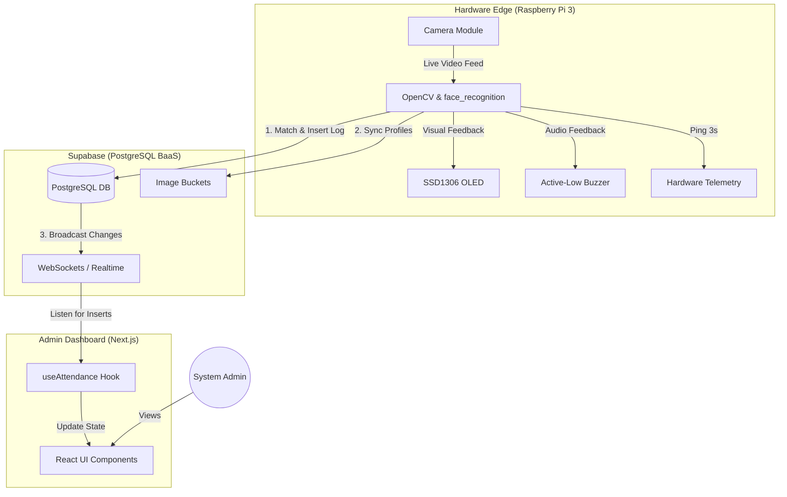
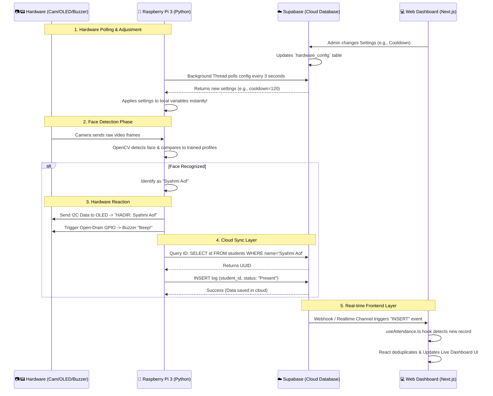

# Real-Time Facial Recognition Attendance System (Greetly)

**Greetly** is a cloud-integrated, real-time facial recognition student attendance monitoring system. It leverages a modern tech stack (Next.js, Supabase, Python Edge Node) to provide seamless attendance tracking, live dashboard monitoring, hardware telemetry, and an automated CI/CD pipeline for rapid deployments.

---

## 1. System Architecture & CI/CD Pipeline

To ensure high availability, secure data transfer, and automated deployments, Greetly is architected using best-in-class cloud and edge technologies.

### A. Core Workflow Diagram



### B. CI/CD Pipeline (Deployment Architecture)

We utilize a zero-downtime deployment strategy. Any code pushed to the `main` branch automatically triggers a build process.


- **GitHub:** Acts as the single source of truth for version control.
- **Vercel:** PaaS platform that automatically intercepts GitHub webhooks, runs the Next.js build, and deploys the application to an edge network.
- **Cloudflare:** Manages DNS routing (`greetly.syahmiaof.my`) and provides DDoS protection, while Vercel handles the SSL termination.

---

## 2. Sequence Diagram (Data & Hardware Flow)

This diagram explains exactly how the hardware modules (Camera, OLED, Buzzer) interact with the Raspberry Pi 3, and how the entire system syncs bi-directionally with your Web Dashboard.



---

## 3. Hardware Setup

The physical attendance kiosk runs on a Raspberry Pi 3 with the following peripherals:

- **Raspberry Pi Camera:** Captures the live video feed. Enabled via `raspi-config`.
- **SSD1306 OLED Display:** Connected via I2C (`SDA`, `SCL`). Displays system status, time, and immediate feedback.
- **Active-Low Buzzer:** Connected to **BCM 4** (GPIO 4). Provides audio feedback (a short beep) when a face is successfully recognized. 
  *(Note: Driving the pin `LOW` turns the buzzer on, and `HIGH` turns it off.)*

---

## 4. Database Schema (Supabase)

### `students`
Stores student profiles and facial encoding references.
- `id`: `uuid` (Primary Key)
- `matric_no`: `varchar` (Unique identifier)
- `name`: `varchar`
- `image_url`: `text`

### `attendance_logs`
Stores the actual attendance punches.
- `id`: `uuid` (Primary Key)
- `student_id`: `uuid` (Foreign Key -> `students.id`)
- `status`: `varchar`
- `timestamp`: `timestamptz` (Default: `now()`)

### `hardware_telemetry`
Used by the Pi to report its health status (Ping every 3 seconds).
- `id`: `integer` (Primary Key)
- `cpu_temp`: `numeric`
- `cpu_usage`: `numeric`
- `last_ping`: `timestamptz`

---

## 5. Running the Web Dashboard Locally

1. Create a `.env.local` file and add your Supabase keys:
   ```env
   NEXT_PUBLIC_SUPABASE_URL=your_supabase_project_url
   NEXT_PUBLIC_SUPABASE_ANON_KEY=your_supabase_anon_key
   ```
2. Install dependencies and run:
   ```bash
   npm install
   npm run dev
   ```

---

## 6. Running the Pi Script (Hardware Node)

The Python script (`pi_scripts/recognize_attendance.py`) handles face detection and Supabase communication.

1. Install Python requirements:
   ```bash
   pip install -r requirements.txt
   ```
2. Export your Supabase credentials:
   ```bash
   export SUPABASE_URL="your_supabase_url"
   export SUPABASE_KEY="your_supabase_service_role_key"
   ```

### Running as a Systemd Service (Kiosk Mode)
To ensure the script runs automatically on boot and recovers from crashes:
1. Create `sudo nano /etc/systemd/system/kiosk.service`
2. Enable and start:
   ```bash
   sudo systemctl enable kiosk.service
   sudo systemctl start kiosk.service
   ```

---

## 7. Key Engineering Decisions

### 1. Auto-Delete Profiles Sync
If a student is deleted from the web dashboard, their corresponding facial encodings and reference images are automatically purged from the Raspberry Pi 3's local cache via realtime listener triggers. This prevents the edge device from wasting processing power trying to match deleted faces.

### 2. The 'Sudah Hadir' (Already Present) Logic & Cooldown
To prevent rapid-fire duplicate logs, we introduced a **Cooldown Mechanism**. 
- When a student's face is recognized, their ID is stored locally with a timestamp.
- If detected again within the cooldown window, the UI/OLED displays **"Sudah Hadir"**.
- It skips the database insert and bypasses the buzzer beep, providing silent visual feedback without generating redundant data.

### 3. Local Storage Admin Profile Sync
The admin settings page uses a highly optimized `useAdminProfile` React Hook integrated with browser `localStorage`. When the admin updates their Name, Role, or uploads an Avatar (converted to Base64), a CustomEvent (`profile-updated`) is dispatched, instantly syncing the UI across the entire dashboard without requiring a page refresh or backend database roundtrip.
