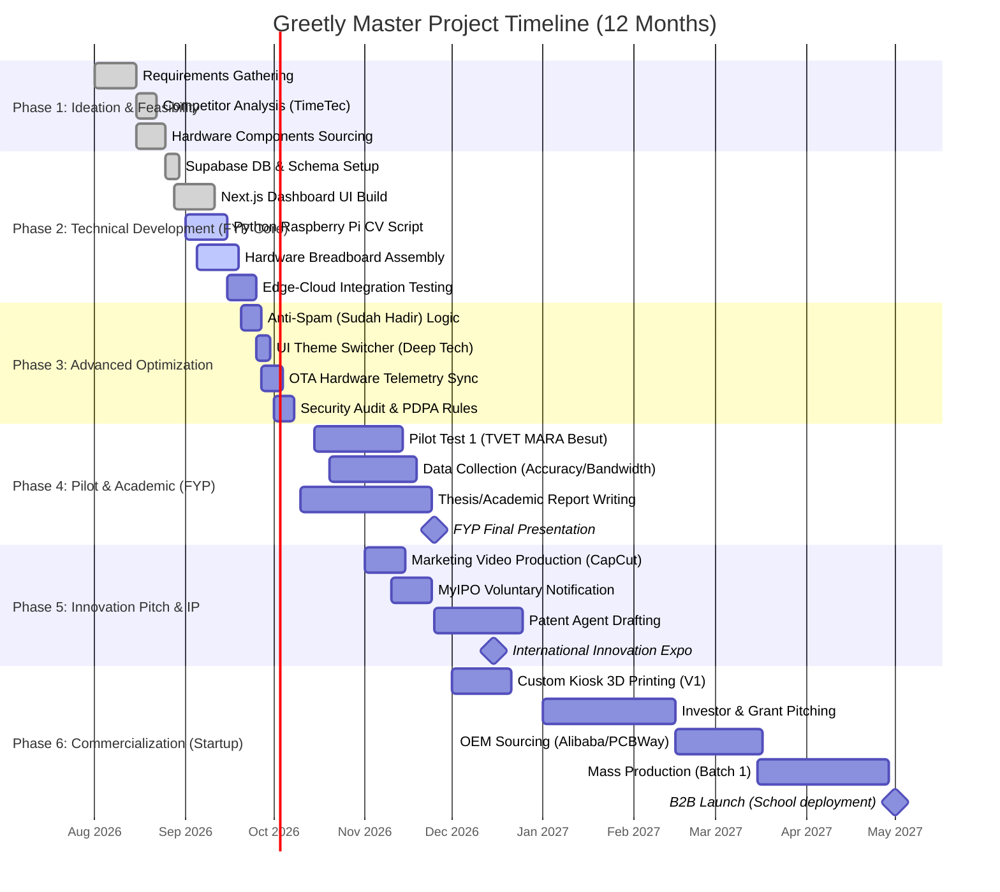

# Greetly: Detailed Technical & Commercialization Gantt Chart

Jadual perancangan (Gantt Chart) ini meliputi fasa teknikal (FYP), validasi pasaran (Pertandingan Inovasi), dan pengkomersilan penuh (Startup/VC).

