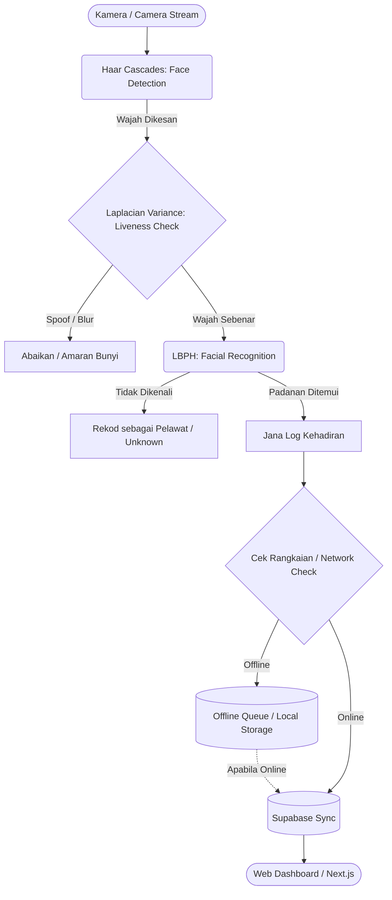

# Greetly: Senibina dan Implementasi AI

Dokumen ini memperincikan pelaksanaan kecerdasan buatan (AI) sedia ada dalam sistem **Greetly** (IoT Facial Recognition Attendance System), peranan *AI Agents* dalam proses pembangunannya, aliran kerja AI, serta peta jalan (roadmap) cadangan integrasi AI masa hadapan.

## 1. Senibina AI Sedia Ada (Current AI Implementation)

Sistem Greetly menggunakan pendekatan **Edge AI** di mana pemprosesan komputer penglihatan (computer vision) berlaku terus pada peranti (Raspberry Pi 3) untuk mengurangkan kependaman (latency) dan kebergantungan kepada sambungan internet berterusan. Tiga algoritma utama yang digunakan adalah:

- **Haar Cascades (Face Detection):**
  Digunakan untuk mengesan kehadiran wajah manusia dalam suapan video (video stream) secara masa nyata (real-time). Ia adalah algoritma *machine learning* berasaskan *classifier* yang cekap memproses dan mengenalpasti struktur asas wajah dengan membandingkan piksel terang dan gelap menggunakan *Haar features*.

- **LBPH - Local Binary Patterns Histograms (Facial Recognition):**
  Algoritma pengecaman wajah yang stabil terhadap perubahan pencahayaan. Ia mengekstrak tekstur dan ciri tempatan (local features) wajah dengan membandingkan piksel tengah dengan kawasan sekitarnya. Corak ini kemudiannya disimpan sebagai histogram untuk dipadankan dengan pangkalan data pelajar semasa mengambil kedatangan.

- **Laplacian Variance (Anti-Spoofing / Liveness Detection):**
  Teknik pengesanan *liveness* asas untuk mengelakkan penipuan (spoofing) menggunakan gambar pegun atau skrin telefon. Ia berfungsi dengan mengira varians (variance) yang dihasilkan oleh *Laplacian filter* bagi menentukan tahap fokus atau kekaburan (blurriness). Objek 2D atau gambar yang dipaparkan pada skrin biasanya memberikan nilai varians yang berbeza (lebih kabur) berbanding wajah fizikal sebenar.

## 2. Peranan AI Agent dalam Pembangunan (Development AI)

Sepanjang fasa pembangunan, **Antigravity AI Agents** telah memainkan peranan kritikal sebagai *AI Solutions Architect* dan pembantu pengekodan:

- **Seni Bina Sistem (System Architecture):** Ejen AI membantu merekabentuk topologi sistem menyeluruh yang menghubungkan perkakasan (Raspberry Pi), *backend/database* (Supabase untuk DB/Auth), dan papan pemuka web (Next.js Dashboard).
- **Penyelesaian Masalah Perkakasan Kompeks (Complex Hardware Debugging):** Menyelesaikan ralat isyarat GPIO, contohnya menganalisis isu *High-Z Open Drain* bagi komponen pembaz (buzzer) untuk memastikan tindak balas bunyi (audio feedback) yang konsisten.
- **Automasi Pelaksanaan (Deployment Automation):** Membantu menulis dan menstrukturkan skrip *Remote OTA (Over-The-Air) SFTP* untuk memudahkan pemindahan kod dari mesin pembangunan ke peranti IoT dari jarak jauh, mempercepatkan kitaran ujian.

## 3. Aliran Kerja AI (AI Workflow)

Carta alir di bawah menunjukkan bagaimana data diproses bermula daripada tangkapan kamera sehinggalah ia disegerakkan ke pangkalan data awan.

## 4. Cadangan Masa Depan: AI Automation & AI Agents (Future Roadmap)

Bagi pembentangan projek tahun akhir (FYP), cadangan naik taraf berikut boleh diketengahkan untuk menunjukkan potensi penuh sistem pintar Greetly:

- **AI WhatsApp Automation:**
  Mengintegrasikan agen AI yang memantau jadual kehadiran harian. Apabila pelajar dikesan ponteng atau lewat secara konsisten, ejen ini akan mengarang dan menghantar mesej WhatsApp peribadi (secara automatik) kepada ibu bapa/penjaga untuk memaklumkan status kehadiran dengan nada empati yang sesuai.

- **Predictive Analytics (Machine Learning):**
  Menggunakan model pembelajaran mesin (ML) pada data Supabase untuk mengenalpasti corak kehadiran. Sistem ini boleh membuat ramalan (predict) kebarangkalian berlakunya ponteng tegar berdasarkan trend, lokasi, cuaca, atau hari tertentu dalam minggu, sekaligus membolehkan guru kaunseling bertindak lebih awal.

- **Natural Language Dashboard Assistant (LLM Chatbot):**
  Menyediakan pembantu AI berasaskan *Large Language Model (LLM)* dalam Dashboard Next.js. Guru dan pentadbir boleh bertanya soalan harian dalam bahasa biasa seperti *"Siapa lambat hari ini?"* atau *"Berapa peratus kehadiran kelas 5 Sains?"*. Ejen AI ini kemudiannya akan menjana pertanyaan SQL (query) ke pangkalan data Supabase dan memberikan jawapan secara pantas dan semulajadi.

**Senibina Memori AI Chatbot (Bagaimana AI Mengingat):**
Untuk menjadikan Chatbot Greetly pintar, ia akan menggunakan tiga lapisan memori:
1. **Memori Jangka Pendek (Session Context):** Menggunakan *Vercel AI SDK*, sejarah perbualan (chat history) disimpan sementara dalam format tatasusunan (array) `messages`. Setiap kali pengguna menaip soalan baru, keseluruhan sejarah perbualan dihantar kepada *Gemini API* supaya AI faham konteks perbualan yang sedang berlangsung.
2. **Memori Jangka Panjang (Supabase Database):** Untuk membolehkan guru menyambung perbualan hari sebelumnya, array `messages` ini akan disimpan (saved) ke dalam jadual khas di Supabase (contoh: `chat_history`). Apabila guru log masuk, sejarah perbualan akan ditarik (fetch) semula.
3. **Memori Data Sebenar (Function Calling / Grounding):** AI LLM itu sendiri tidak "menghafal" jadual kedatangan pelajar (kerana data LLM statik). Sebaliknya, apabila cikgu bertanya "Siapa ponteng?", AI akan menggunakan fungsi *Tool Calling* untuk bertanya (query) secara terus kepada *database* Supabase dan memberikan jawapan berdasarkan data yang paling terkini (live data).
